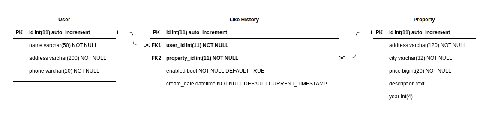
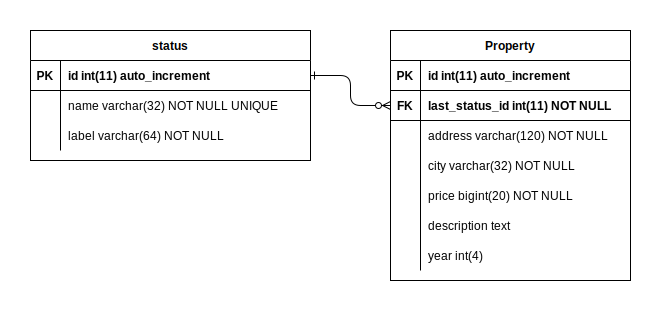

# Consultation Service API #

This repository implements an API to query the information of the properties available for sale using Python 3.10

## Install

First of all

```
cd consultation-service
```

Create the .env file following the example below

```
APP_HOST=localhost
APP_PORT=8080
MYSQL_HOST=
MYSQL_PORT=
MYSQL_USER=
MYSQL_PASS=
MYSQL_DB=
```

Make sure you are using Poetry

```
poetry self add poetry-dotenv-plugin
poetry install
poetry run python3 setup.py
```

## Routes

```
curl --location --request GET 'http://localhost:8080/api/v1/properties?status=pre_venta&year=2023&city=bogota'
```

The service provides a single endpoint with three different parameters:  
* ***status***
String can be any of these: pre_venta, en_venta, vendido

* ***year***
String with the following format YYYY

* ***city***
String, for example: bogota

## About expected JSON

We are using query parameters to handle the filters, so there is no need for the front-end application to send a json body.
Usually a GET query does not have a body.

## Tech Stack

* ***http.server***
Python standard library that includes classes for implementing HTTP servers

* ***mysql-connector-python***
MySQL driver written in Python

## Development Approach
I intend to implement the code using the hexagonal architecture to separate the various layers in an organized manner.
I will adhere to coding standards such as PEP8 to ensure clean and readable code.
Furthermore, I will employ the Builder pattern and the Criteria pattern to define and apply filters flexibly and decoupled, thereby enabling scalability.
For handling database operations, I will use the Repository pattern.
Additionally, I will leverage Python's standard libraries to manage queries through a single endpoint that will support multiple filters.

## Folder structure


## Like feature

Following the premise that we wanted to record the likes that the user gives,
the proposed scheme stores a record in the database when clicking on like.
In a similar way, the user is allowed to remove the like storing a new record with the "enabled" field to "false".
If it is not necessary to remove the "like",
we can omit the "enabled" field and add a unique constraint on the "user_id" and "property_id" fields, 
so the user will not be able to click like several times.

The "like_history" table relates users to properties,
allowing additional information to be added without modifying the related tables.
This database table is in its normalized form, which reduces data redundancy and ensures integrity.

### Diagram


### Code

The file is located in the docs folder

```
CREATE TABLE like_history (
  id int(11) NOT NULL,
  user_id int(11) NOT NULL,
  property_id int(11) NOT NULL,
  enabled bool NOT NULL DEFAULT TRUE,
  create_date datetime NOT NULL DEFAULT CURRENT_TIMESTAMP,
  PRIMARY KEY (id),
  FOREIGN KEY (user_id) REFERENCES user(id),
  FOREIGN KEY (property_id) REFERENCES property(id)
);
```

## Additional improvement

We can add a new field to the "property" table to simplify and speed up queries related to the property status.
The proposed field is called "last_status_id" and is related to the last recorded status of the property,
a "trigger" can be used to keep it updated.

### Diagram

