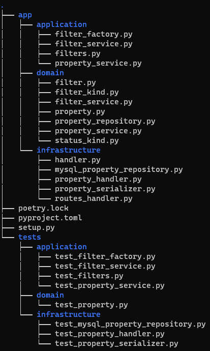

# Consultation Service API #

This repository implements an API to query the information of the properties available for sale using Python 3.10

## Install

First of all

```
cd consultation-service
```

Create the .env file following the example below

```
APP_HOST=localhost
APP_PORT=8080
MYSQL_HOST=
MYSQL_PORT=
MYSQL_USER=
MYSQL_PASS=
MYSQL_DB=
```

Make sure you are using Poetry

```
poetry install
poetry shell
poetry run python3 setup.py
```

## Routes

```
curl --location --request GET 'http://localhost:8080/api/v1/properties?status=pre_venta&year=2023&city=bogota'
```

The service provides a single endpoint with three different parameters:  
* ***status***
String can be any of these: pre_venta, en_venta, vendido

* ***year***
String with the following format YYYY

* ***city***
String, for example: bogota

## Tech Stack

* ***http.server***
Python standard library that includes classes for implementing HTTP servers

* ***mysql-connector-python***
MySQL driver written in Python

## Development Approach
I intend to implement the code using the hexagonal architecture to separate the various layers in an organized manner.
I will adhere to coding standards such as PEP8 to ensure clean and readable code.
Furthermore, I will employ the Builder pattern and the Criteria pattern to define and apply filters flexibly and decoupled, thereby enabling scalability.
For handling database operations, I will use the Repository pattern.
Additionally, I will leverage Python's standard libraries to manage queries through a single endpoint that will support multiple filters.

## Folder structure

